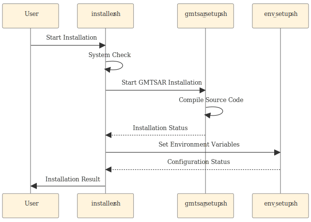
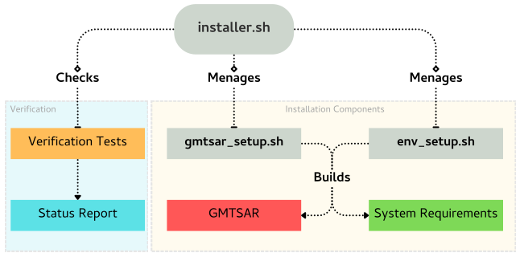

# Summary

**GMTSAR Auto Installation Tool (GMTSAR-AIT)** is a lightweight, open‑source automation utility that prepares a fully functional **GMTSAR** environment on Ubuntu LTS systems with minimal user intervention. The tool orchestrates operating‑system dependency installation, Anaconda setup, compilation from source, environment‑variable configuration, and post‑installation validation. By standardizing the installation pathway for **InSAR** processing, GMTSAR‑AIT reduces time‑to‑analysis, minimizes configuration errors, and supports reproducible research in radar interferometry [@sandwell2011; @moreira2013a; @franceschetti2018; @cui2018; @busto2024].

# Statement of need

With the commercialization of Synthetic Aperture Radar (SAR) technology, which was originally developed for military purposes, high-resolution SAR images began to be obtained using aircraft and satellite systems [@sherwin1962]. This advancement has had a significant impact on geographic information systems (GIS), remote sensing, and geodesy. The use of SAR technology in space has become widespread, with artificial satellites employing SAR to monitor the Earth's surface over large areas and at regular intervals. During this period, SAR imagery has been utilized in various applications, including monitoring environmental changes, detecting forest fires, tracking glaciers, and observing surface deformations [@franceschetti2018; @vilardo2009].

Since the 2000s, SAR technology has been further developed and has found a wider range of applications. Its ability to generate high-resolution data independent of weather conditions has made SAR technology crucial for various fields, including disaster management, agricultural monitoring, maritime navigation, and energy production. Furthermore, SAR technology has become a valuable research tool for scientists, enabling numerous discoveries in geosciences and environmental sciences [@hamdi2021; @moreira2013b].

Synthetic Aperture Radar (SAR) imaging exhibits resilience against various weather conditions compared to other imaging methods. This characteristic makes SAR particularly suitable for continuous monitoring tasks. Moreover, this capability is especially advantageous for missions involving water surfaces affected by cloud cover, fog, or darkness, which typically limit the effectiveness of optical sensors [@moreira2013a; @busto2024].

GMTSAR is an open-source software package used for processing InSAR (Interferometric Synthetic Aperture Radar) data [@sandwell2011]. This package has been specifically developed for analyzing surface deformations and modeling geophysical phenomena [@cui2018]. The software is designed for users familiar with Unix systems and the Generic Mapping Tools (GMT) software suite. However, software installation can be challenging for beginners due to system permissions and dependency management complexities.

Although **GMTSAR** is widely adopted for interferometric SAR workflows, first‑time installation is often a barrier for researchers and students due to intricate package dependencies, compiler requirements, and shell configuration. Manual misconfigurations (e.g., missing libraries, incorrect paths) can silently degrade processing quality or invalidate results. With the development of GMTSAR-AIT, the installation of the open-source InSAR processing tool GMTSAR on Ubuntu-based systems has been streamlined to minimize user intervention, enabling researchers to focus on their primary research activities rather than spending time on complex compilation and configuration processes.

# Software description

## Design and architecture

GMTSAR‑AIT follows a modular architecture implemented as shell scripts (\autoref{fig:workflow}):

- **`installer.sh`** — orchestrates end‑to‑end setup: system preparation, package installation, Anaconda provisioning, source compilation, environment configuration, and validation.
- **`gmtsar_setup.sh`** — compiles GMTSAR from source and integrates system libraries, exposing multi‑threaded builds where appropriate.
- **`env_setup.sh`** — configures PATH and library links, and optionally prepares an isolated Conda environment to avoid package conflicts.

Built‑in error trapping and status reporting reduce failure modes during long, multi‑step installs. A final verification phase checks the presence and operability of key GMTSAR components.



The modular structure of GMTSAR-AIT provides flexibility and maintainability (\autoref{fig:modular}). Each component handles specific aspects of the installation process, allowing for easy debugging and future enhancements.



## Availability and repository

Source code: <https://github.com/bcankara/GMTSAR-auto-installation-tool>  
License: MIT

# Installation and usage

On a fresh Ubuntu LTS system with `git` and `bash`:

```bash
git clone https://github.com/bcankara/GMTSAR-auto-installation-tool.git
cd GMTSAR-auto-installation-tool
cp installer.sh gmtsar_setup.sh env_setup.sh ~/
cd ~
chmod +x installer.sh
bash installer.sh
```

Upon completion ("Installation Complete"), GMTSAR commands (e.g., `make_inps`, `csh p2p_processing.csh`) should be available in the shell. Ensure your shell configuration (e.g., `.bashrc`) is reloaded.

# Limitations and future work

Current support targets Ubuntu LTS; broader testing across distributions and optional environment managers beyond Anaconda are planned. Future work includes improved CI‑based preflight checks and containerized distribution.

# Acknowledgements

We thank the GMTSAR developers and the open‑source community for foundational tools and documentation.

# References
